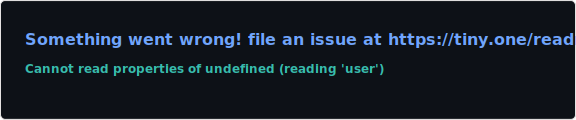

<h1 align="center">Hey, I'm Tejas</h1>

<p align="center">
  <b>CS student | Systems & AI enthusiast | Always building</b>
</p>

<p align="center">
  <a href="https://screenager.dev" target="_blank">
    
  </a>
  <a href="https://github.com/tejas242?tab=repositories" target="_blank">
    
  </a>
</p>

## GitHub Stats

<div align="center">
  
[](https://github.com/tejas242)
[](https://github.com/tejas242)

</div>

---

**About Me**

- I build things that think — AI, LLMs, and real-world apps.
- I love clean systems, efficient design, and making stuff just work.
- I [write](https://screenager.dev/blog)

---

**Tech I'm into**

```bash
> Lang       | C++, Golang, Python, TypeScript
> AI/ML      | Deep Learning, LLMs, Vision, Kaggle, HF
> Systems    | Networking, OS, Linux (btw, I use Arch)
> Tools      | FastAPI, Next.js, Vector DBs, Postgres, Mongo
> And much more...
```

**Latest from the Blog**

<!-- BLOG:START -->
- [What Actually Happens When You Press ^C?](https://screenager.dev/blog/2025/what-actually-happens-when-you-press-ctrl-c)
- [Nerds Like to Ping](https://screenager.dev/blog/2025/why-ping-is-a-masterpiece-of-network-diagnostics)
- [Git Diff Is Just LCS](https://screenager.dev/blog/2025/diff-algorithm-hunt-mcilroy)
<!-- BLOG:END -->
