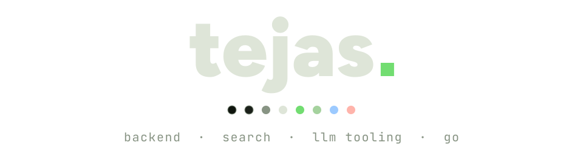

<picture>
  <source media="(prefers-color-scheme: dark)" srcset="assets/header-dark.svg">
  <source media="(prefers-color-scheme: light)" srcset="assets/header-light.svg">
  
</picture>

 
 

tonight's sky over screenager.dev · there is a different one for every day of the week

 
 
I build things to find out how they work. Sometimes they work. 
I ship production Python and TypeScript: document ingestion, hybrid search and the tool servers LLMs call. 
On the side I write Go to see how things work, then write down what happened. 
ICPC Asia West regionalist, 2025–26.

 

<a href="https://screenager.dev">screenager.dev</a> &nbsp;·&nbsp; <a href="https://www.linkedin.com/in/tejas242">linkedin</a>

 

 

## projects

**[sift](https://github.com/Tejas242/sift)** &nbsp;semantic search over a folder of code and notes, offline, on the CPU 
go · onnx runtime · bubble tea · an HNSW index written from scratch
 

**[dots](https://github.com/Tejas242/dots)** &nbsp;my desktop, coloured from its wallpaper; the lock screen plays records 
niri · noctalia · astronvim · 1366×768
 

**[arxiv-mcp](https://github.com/Tejas242/arxiv-mcp)** &nbsp;lets AI assistants search arXiv and cite papers instead of guessing at them 
python · mcp · docker
 

 

## upstream

`2026`&nbsp; [goodroot/hyprwhspr #215](https://github.com/goodroot/hyprwhspr/pull/215) &nbsp;fixed setup failing on nested requirement files 
`2026`&nbsp; [rsyslog/loganalyzer #101](https://github.com/rsyslog/loganalyzer/pull/101) &nbsp;made exports cover every page, not just the one on screen 
`2025`&nbsp; [npm/cli #8683](https://github.com/npm/cli/pull/8683) &nbsp;documented the ignore-scripts flag for npm version

 

## writing

<!-- writing:start -->
`2026`&nbsp; [A typeface from one letter](https://screenager.dev/blog/a-typeface-from-one-letter/) 
`2026`&nbsp; [Everything falls into step](https://screenager.dev/blog/everything-falls-into-step/) 
`2026`&nbsp; [Why can’t you zip a zip?](https://screenager.dev/blog/why-you-cant-zip-a-zip/) 
`2026`&nbsp; [Anatomy of a page](https://screenager.dev/blog/anatomy-of-a-page/) 
`2025`&nbsp; [What actually happens when you press ^C?](https://screenager.dev/blog/what-actually-happens-when-you-press-ctrl-c/)
<!-- writing:end -->

 

 
 

the long version, mostly made up: <a href="https://screenager.dev/about">screenager.dev/about</a>

